# Potluck Warzone Keycloak Theme

Author: **Eko Sutrisno** [Github](https://github.com/ekosutrisno)

* This theme structure is based on the `keycloak.v2` theme.
* Supported Keycloak versions: `v26+`
* Tested on `Chromium-based` browsers, `Firefox`, and `Safari`.
* Generated Jar file size under `350kb`.

## Change Theme

Via Realm (Will used by all client by default)

* Realm Settings -> Themes -> Login Theme

Via Specific Client

* Clients -> YOUR_CLIENT -> Login Settings -> Login Theme

Enable Login feature (optional)

* Realm Settings -> Login

Enable some Authentcation feature (optional)

* Configure Meny -> Authentication -> Required Action

## Intro

This theme focuses on customizing the Standard Login Theme page with full `responsive` support.

CSS Framework: **TailwindCSS**

Customized Pages:

* Login
* Register (Include )
* Forgot/Reset Password
* Email Verification
* Update Email (Keycloak Preview Feature)
* Passcode (Keycloak Preview Feature)
* Recovery Code (Keycloak Preview Feature)
* Update Password
* Setup 2FA OTP
* Setup Recovery Code
* Setup Passkey
* Login with (OTP, Recovery Code, Passkey)
* OAuth Grant Login
* Update Profile when new attributes are required
* Custom Alert Style
* Social Provider Layout and Button Style

## Local Development

* Clone this repo

```sh
git clone https://github.com/ekosutrisno/keycloak-potluck-warzone-theme.git
```

* Copy all theme files and folders to the `themes` directory in your Keycloak installation

* Go to `themes` directory and install all TailwindCSS dependency

```sh
npm run install
```

* Run and Generate (Watch Mode)

```sh
npm run dev
```

## Build JAR

* If you make any changes and run `npm run dev`, you need to copy and replace the `potluck.warzone` folder from the root directory to `theme/potluck.warzone`.
* Ensure that Java (`java -version`) and Maven (`mvn -version`) are installed on your machine.
* Run `mvn clean package`.

## Use Theme with Docker (Docker Compose)

This Docker Compose file assumes that `potluck-warzone-1.0.0.jar` is in the same directory as `docker-compose.yml`. If it is in a different folder, please adjust the paths accordingly.

Or you can go to `docker` folder and then run `docker compose up -d`. It will run docker for you.

If you want to use email functionaly in local development you can use config below for testing.

<http://localhost:5000> to go to Web Email Client

```txt
From: auth@local.com
From display name: Your App Name
Host: host.docker.internal
Port: 2525


*Note: Make sure your admin user in Master real have an email (you can use random email on local development)

```

```docker-compose
services:
  keycloak:
    image: quay.io/keycloak/keycloak:26.0.0
    container_name: keycloak
    volumes:
      - ./potluck-warzone-1.0.0.jar:/opt/keycloak/providers/potluck-warzone-1.0.0.jar
    environment:
      KEYCLOAK_ADMIN: admin
      KEYCLOAK_ADMIN_PASSWORD: admin123
    ports:
      - "8080:8080"
    command: 
      - start-dev
      - --features=preview
  smptpdev:
    image: rnwood/smtp4dev
    container_name: smptpdev
    ports:
      - "5000:80"
      - "2525:25"
```

## Preview Page

### Login Page

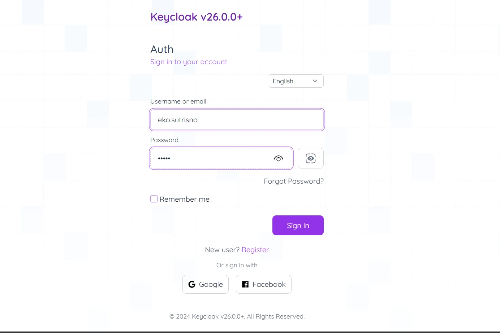

### Login With OTP Page

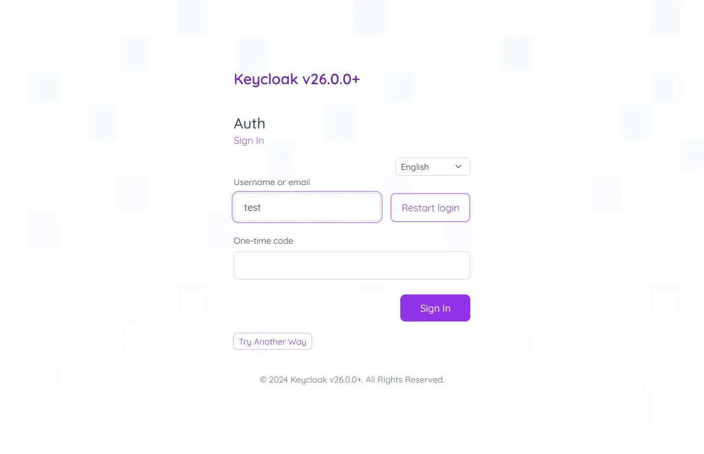

### Update Password Page

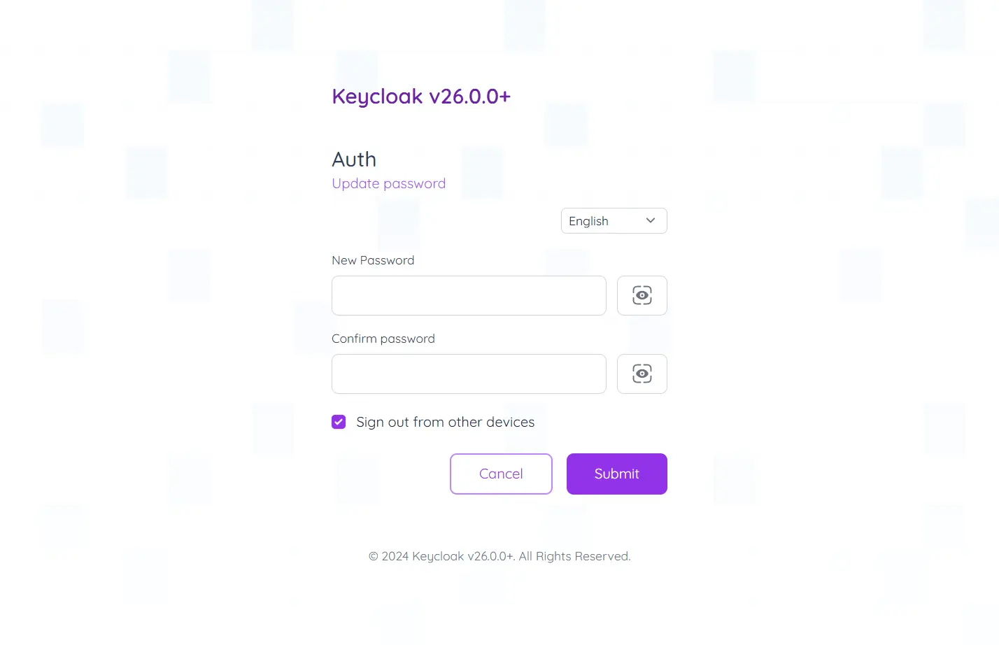

### Setup 2FA OTP Page

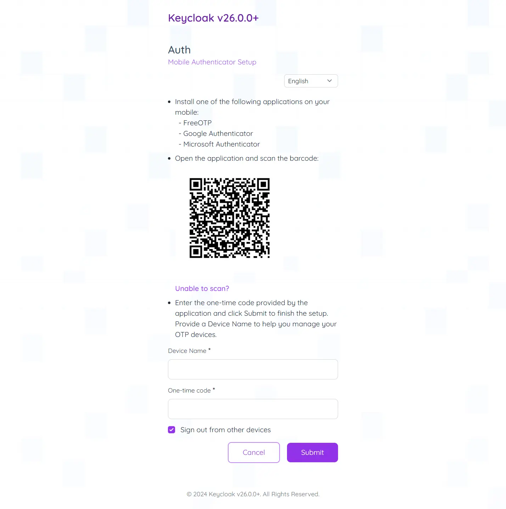

### Setup Passkeys

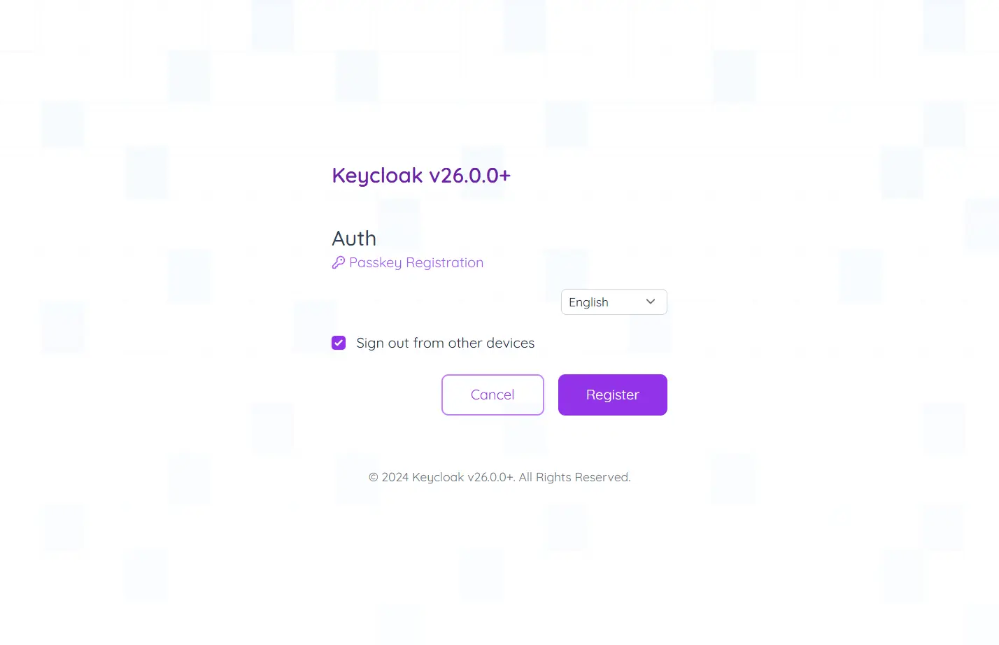

### Setup Recovery Code

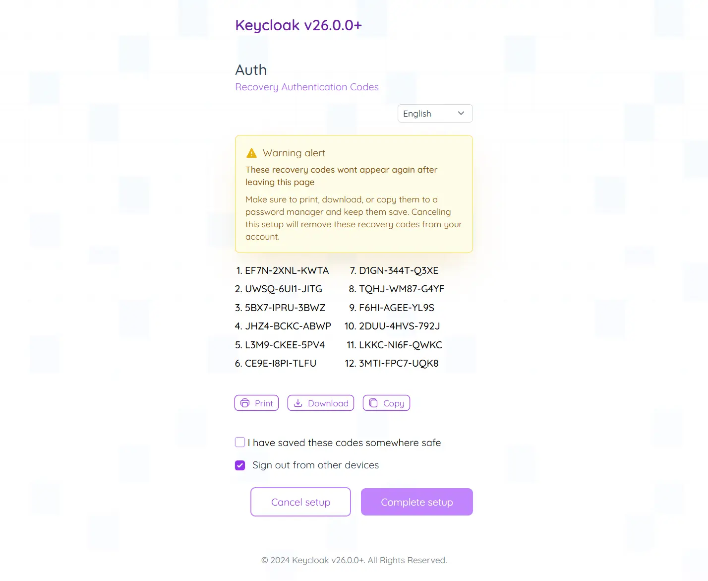

### Reauthenticate

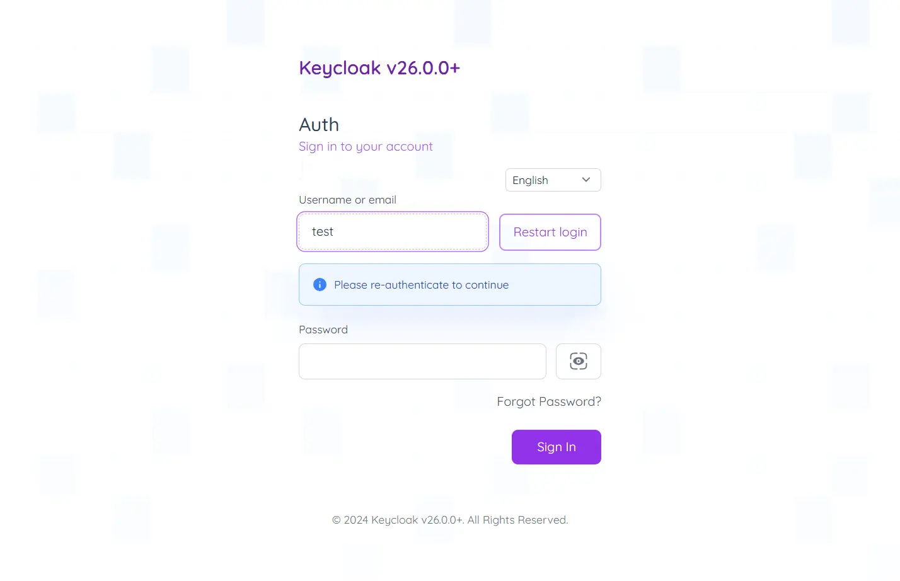

### Update Email

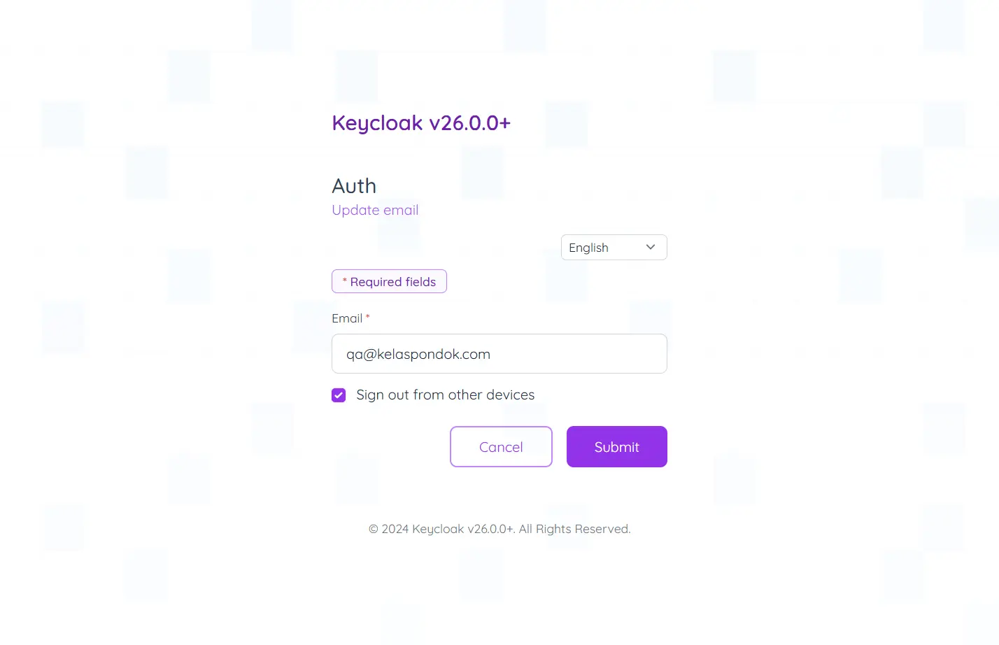

### Select 2FA

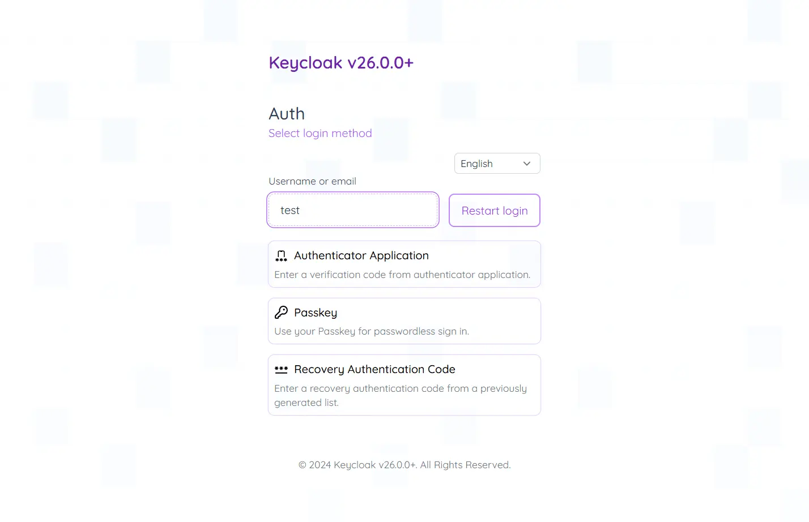

### OAuth Consent and Grant

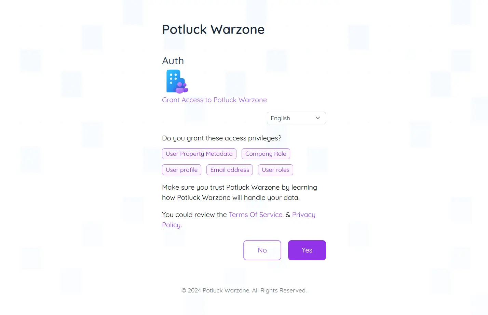

### Delete Account

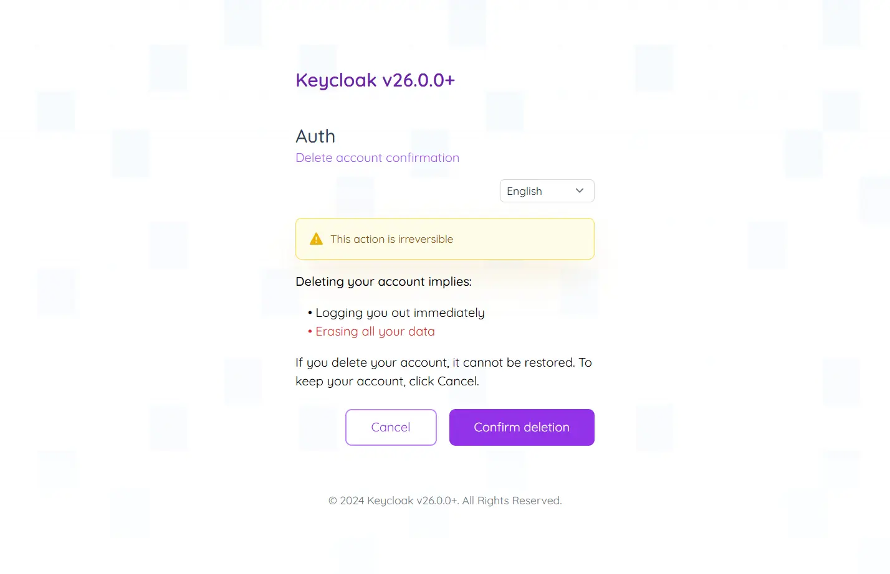

For the Register, forgot password, and others, you can try it out by yourself.
